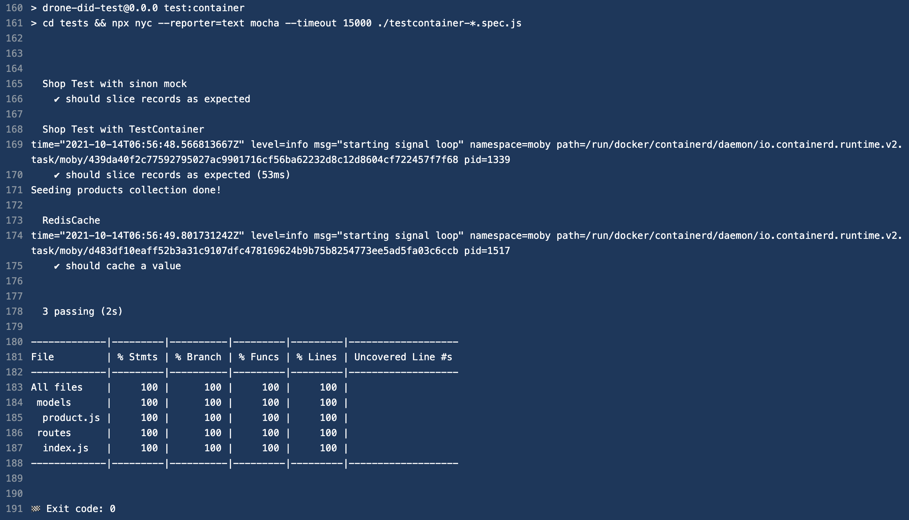

# Demo TestContainers with Drone DiD

Use testContainers to let you run the identical CI test verifications in both local and remote CI server before checkin. And in CI pipeline, it's always a good practice to isolate from real 3rd-party runtimes, ex: DB, queue, ELk stacks..., to make your pipeline more stable.
## Requirements

- For testContainers, which is a java library and wrappers, there is no need to include a docker CLI in application docker build image the same way as the example in above wiki doc.
- TestContainers will provision a Ryuk container for cleanup purpose, which also require privileged mode. This is not allowed in our Drone instance also is not needed since those containers will be recycled after build job is completed.

## How-to guide

1. Check .drone.yaml for usage examples
2. Example tests/testcontainer-mongo.spec.js for testing with MongoDB container
3. Example tests/testcontainer-redis.spec.js for testing with Redis container
4. Due to dcoker rate limits limitation and mirror settings seems not working:
    - Publish your test docker image to local docker registry
    - Use images from local registry in .drone.yaml or inside testContainers functions
5. Ryuk container for cleaning up purpose and require privieged permission and produce error messages
    - To disable it, set TESTCONTAINERS_RYUK_DISABLED=true

## How-to test dind-drone-plugin on local desktop

To run dind-drone-plugin on your desktop:

  ```
  sh run_dind_container_local.sh 
  ```

## Example outputs in drone logs

All build steps take about 01m08s ~

